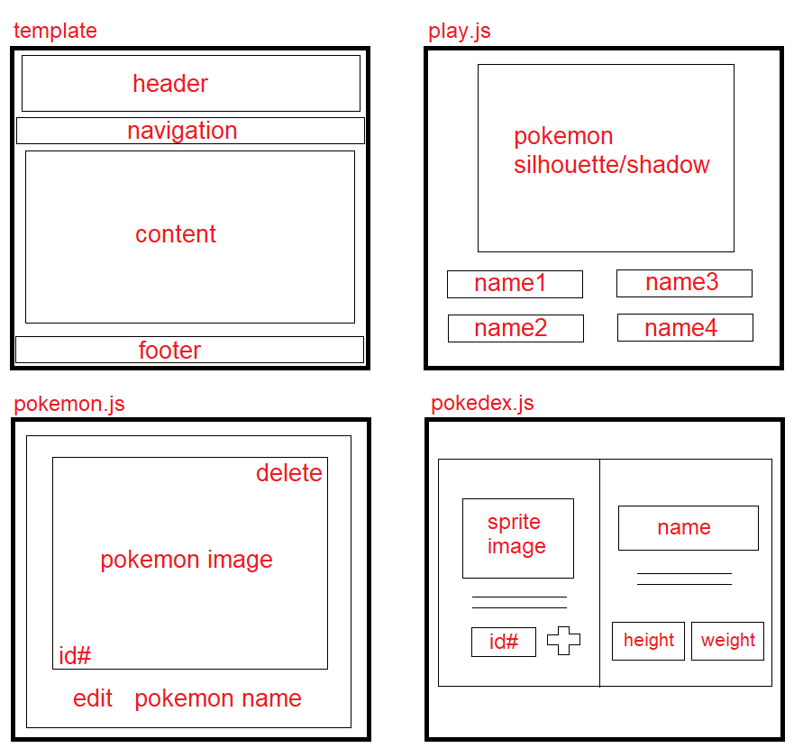
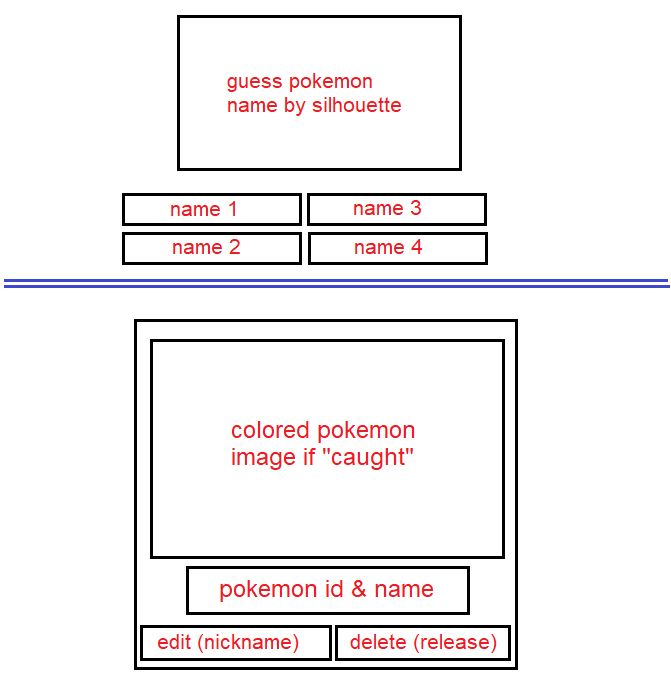

## Project Statement:
API's are a collection of data that can be very long and difficult to read. Using React and front end AJAX requests like Axios, the nested data from the Pokemon API can be utilized and display information in a number of ways that is both informational and fun.

## Target End User:
Anyone who loves Pokemon and wants to see how I made a full stack CRUD app using React and Springboot as the server.

## Link To Deployed App:
will use heroku

## Wireframe:

